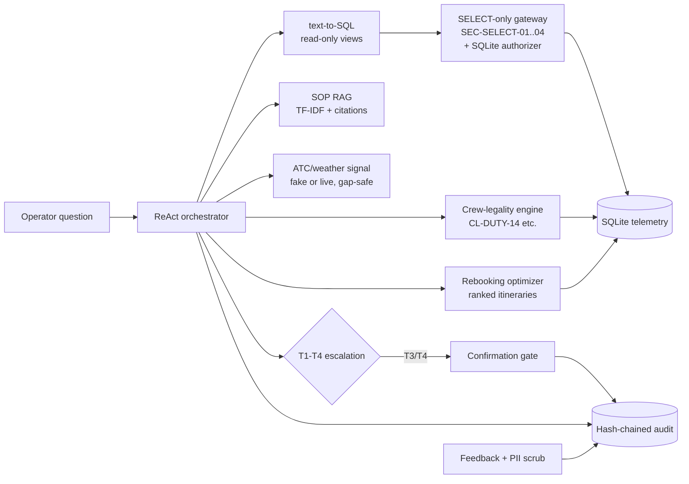
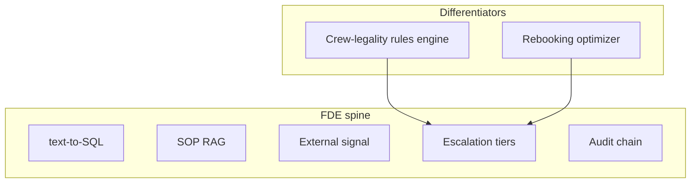

# Architecture

```mermaid
flowchart LR
    Q[Operator question] --> ORC[ReAct orchestrator]
    ORC --> T2S[text-to-SQL\nread-only views]
    ORC --> RAG[SOP RAG\nTF-IDF + citations]
    ORC --> LEG[Crew-legality engine\nCL-DUTY-14 etc.]
    ORC --> RBK[Rebooking optimizer\nranked itineraries]
    ORC --> ATC[ATC/weather signal\nfake or live, gap-safe]
    T2S --> GW[SELECT-only gateway\nSEC-SELECT-01..04<br/>+ SQLite authorizer]
    GW --> DB[(SQLite telemetry)]
    LEG --> DB
    RBK --> DB
    ORC --> ESC{T1-T4 escalation}
    ESC -->|T3/T4| GATE[Confirmation gate]
    GATE --> AUDIT[(Hash-chained audit)]
    ORC --> AUDIT
    FBK[Feedback + PII scrub] --> AUDIT
```

```mermaid
flowchart TD
    subgraph Differentiators
        LEG2[Crew-legality rules engine]
        RBK2[Rebooking optimizer]
    end
    subgraph FDE spine
        T2S2[text-to-SQL]
        RAG2[SOP RAG]
        ATC2[External signal]
        ESC2[Escalation tiers]
        AUD2[Audit chain]
    end
    LEG2 --> ESC2
    RBK2 --> ESC2
```
